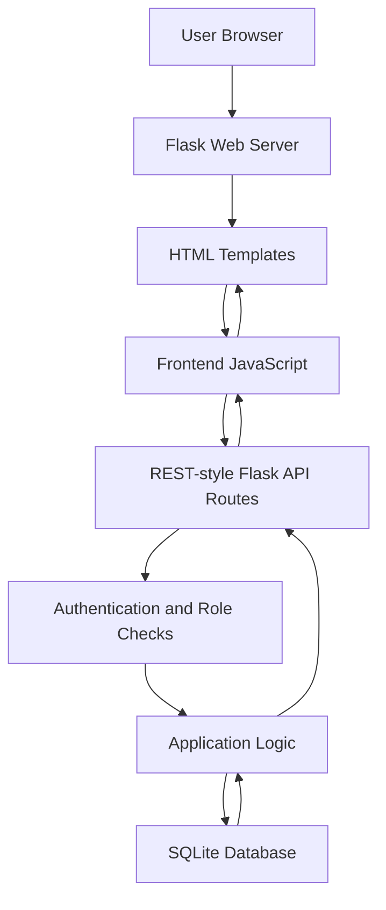
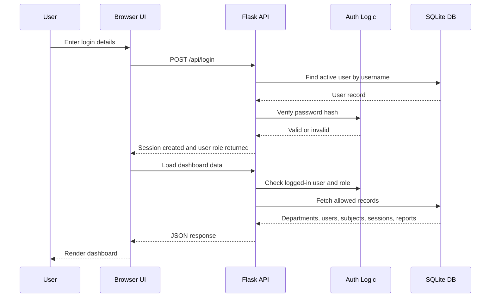
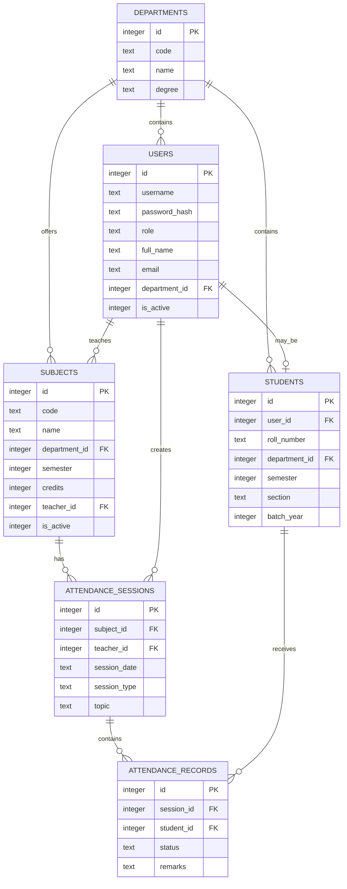
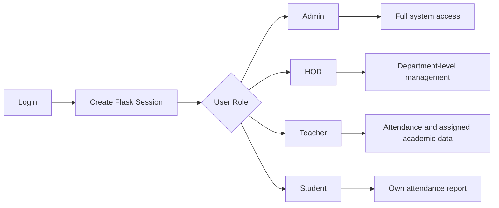
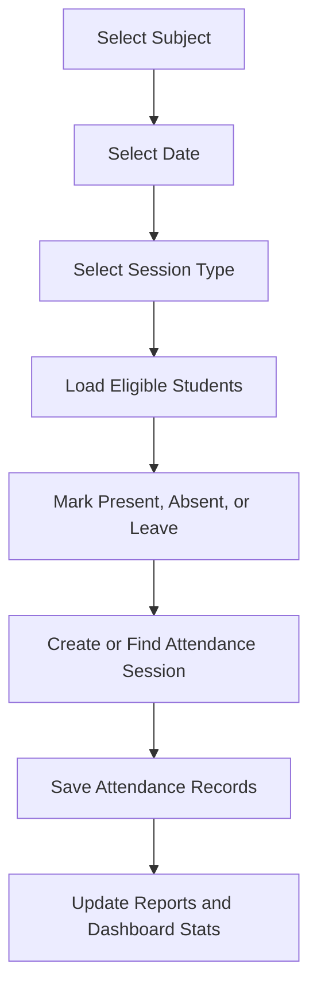
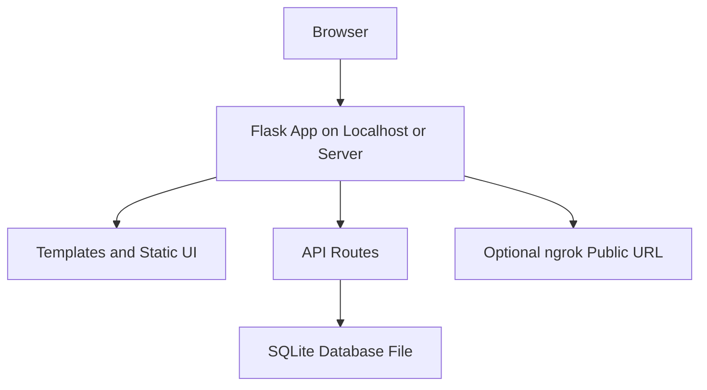

# # TOCE Attendance Management System

A full-stack web application for managing college attendance, users, subjects, sessions, and reports from one secure dashboard.

The project is built for TOCE-style academic workflows where administrators, HODs, teachers, and students need a simple way to manage attendance records and view attendance performance.

## Project Overview

TOCE Attendance Management System is a Flask-based attendance platform with a modern 3D glass-style frontend. It allows role-based users to log in, manage departments and users, add students and subjects, take attendance, and generate reports.

The system is designed to reduce manual attendance work, improve record accuracy, and make attendance data easier to search, update, and analyze.

## Key Features

- Secure login with hashed passwords
- Forgot password and edit password support
- Role-based access for Admin, HOD, Teacher, and Student
- Department management
- User and student management
- Add, edit, search, and delete users
- Subject management with department and semester mapping
- Attendance session creation
- Present, absent, and leave marking
- Student-wise, subject-wise, and department-wise reports
- Dashboard statistics
- Responsive dark 3D frontend design
- SQLite database with automatic table creation

## Tech Stack

- Backend: Python, Flask
- Database: SQLite
- Frontend: HTML, CSS, JavaScript
- Authentication: Flask sessions
- Password Security: PBKDF2-HMAC-SHA256 hashing
- Optional Public Hosting: ngrok

## Comprehensive Architecture Design

The system follows a simple full-stack monolithic architecture. Flask handles page rendering, API routing, authentication, authorization, business logic, and SQLite database access. The frontend uses HTML, CSS, and JavaScript to create an interactive dashboard experience.

### High-Level Architecture



### Architecture Layers

| Layer | Responsibility | Main Files |
| --- | --- | --- |
| Presentation Layer | Login page, dashboard UI, password pages, responsive 3D design | `templates/*.html` |
| Client Logic Layer | Form handling, search, filtering, modal actions, API calls | JavaScript inside `dashboard.html`, `login.html`, `password_access.html` |
| API Layer | JSON endpoints for users, students, subjects, sessions, attendance, and reports | `app.py` |
| Security Layer | Login, sessions, password hashing, role-based access control | `app.py` |
| Business Logic Layer | Attendance rules, user updates, student records, report calculations | `app.py` |
| Data Layer | Tables, relationships, constraints, seeded departments and default users | `toce.db`, schema inside `app.py` |

### Request Flow



### Database Architecture



### Role-Based Access Design



| Role | Access Scope |
| --- | --- |
| Admin | Can manage all departments, users, students, subjects, attendance sessions, and reports |
| HOD | Can manage users, students, subjects, and reports mainly for their department |
| Teacher | Can take attendance and view academic records allowed by the system |
| Student | Can view their own profile and attendance report |

### Functional Module Design

| Module | Main Purpose |
| --- | --- |
| Authentication Module | Handles login, logout, forgot password, and change password |
| User Module | Creates, edits, searches, and deletes users based on role permissions |
| Student Module | Stores student academic details such as roll number, semester, section, and batch |
| Department Module | Stores department code, name, and degree details |
| Subject Module | Connects subjects with departments, semesters, credits, and teachers |
| Attendance Module | Creates attendance sessions and saves student attendance status |
| Report Module | Generates student-wise, subject-wise, and department-wise attendance summaries |
| Dashboard Module | Shows statistics, navigation, management panels, and attendance workflow |

### Attendance Workflow



### Deployment Architecture



For local development, the app runs on `http://localhost:5000`. For temporary public sharing, ngrok can expose the local Flask server through a public HTTPS URL.

### Design Decisions

- A monolithic Flask app keeps the project simple for academic development and demonstration.
- SQLite is used because it is lightweight, file-based, and easy to run without a separate database server.
- API-driven dashboard actions make the frontend more interactive without reloading the whole page.
- Passwords are never stored directly; only salted password hashes are saved.
- Role-based decorators protect sensitive backend routes.
- The database schema uses foreign keys to connect departments, users, students, subjects, sessions, and records.

### Future Scalable Architecture

For a production-level version, the project can be upgraded with:

- PostgreSQL or MySQL instead of SQLite
- Flask Blueprints to separate modules
- Alembic migrations for database version control
- Separate static files for CSS and JavaScript
- REST API documentation using Swagger or OpenAPI
- Docker-based deployment
- Cloud hosting on Render, Railway, AWS, or Azure
- Background jobs for email alerts and report exports

## Project Structure

```text
ATTENDENCE SYSTEM/
|-- app.py
|-- requirements.txt
|-- start.bat
|-- start.sh
|-- toce.db
|-- templates/
|   |-- login.html
|   |-- dashboard.html
|   |-- password_access.html
|   |-- error.html
|-- README.md
```

## Main Pages

- `/login` - Secure login page
- `/forgot-password` - Reset password using username and email
- `/change-password` - Change password after login
- `/dashboard` - Main attendance management dashboard

## Default Login Accounts

| Username | Password | Role |
| --- | --- | --- |
| admin | admin@toce123 | Admin |
| hod_cse | hod@toce123 | HOD |
| teacher1 | teacher@toce123 | Teacher |

Note: If the password was changed from the dashboard, use the updated password.

## Role Permissions

| Feature | Admin | HOD | Teacher | Student |
| --- | --- | --- | --- | --- |
| View dashboard | Yes | Yes | Yes | Yes |
| Manage departments | Yes | Limited | No | No |
| Manage users | Yes | Department users | No | No |
| Manage students | Yes | Department students | Department students | No |
| Manage subjects | Yes | Yes | Limited | No |
| Take attendance | Yes | Yes | Yes | No |
| View reports | Yes | Yes | Yes | Own report |
| Change password | Yes | Yes | Yes | Yes |

## Setup Instructions

### 1. Install Python

Use Python 3.9 or higher.

### 2. Install Dependencies

```bash
pip install -r requirements.txt
```

### 3. Run the App

```bash
python app.py
```

The app starts at:

```text
http://localhost:5000
```

Open the website through the Flask server URL. Do not open the template files directly with `file:///`, because the dashboard needs Flask API routes to load data.

## API Highlights

| Method | Endpoint | Purpose |
| --- | --- | --- |
| POST | `/api/login` | Login user |
| GET | `/api/me` | Get current user |
| POST | `/api/forgot-password` | Reset password |
| POST | `/api/change-password` | Change password |
| GET/POST | `/api/users` | List or create users |
| PUT/DELETE | `/api/users/<id>` | Update or delete user |
| GET/POST | `/api/subjects` | List or create subjects |
| GET/POST | `/api/sessions` | List or create attendance sessions |
| GET/POST | `/api/attendance/<session_id>` | View or save attendance |
| GET | `/api/dashboard/stats` | Dashboard statistics |

## Website Description

This website helps colleges digitize attendance management. Instead of maintaining paper registers or separate spreadsheets, teachers can create sessions, select subjects, mark student attendance, and save records directly in the system.

Admins and HODs can manage users, students, departments, and subjects. Reports make it easier to track attendance performance by student, subject, or department. The updated frontend gives the system a modern 3D dashboard look while keeping the workflow simple and practical.

## Security Notes

- Passwords are stored as salted hashes.
- Login state is handled using Flask sessions.
- API routes are protected with role-based checks.
- SQL queries use parameterized statements.

For production deployment, set a strong fixed Flask secret key, use HTTPS, keep debug mode off, and protect the database file.

## Future Improvements

- Export attendance reports as PDF or Excel
- Add email notifications for low attendance
- Add student self-service report dashboard
- Add charts for monthly attendance trends
- Add deployment configuration for Render, Railway, or PythonAnywhere

## License

This project is created for academic and learning purposes. You can modify and extend it based on your college requirements.
ATTENDENCE-SYSTEM
ATTENDENCE-SYSTEM
